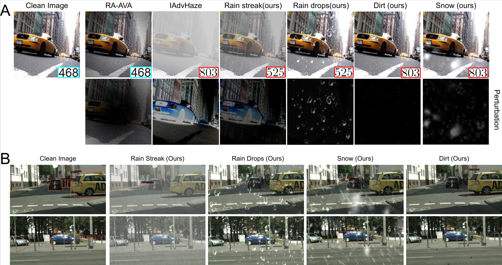

# SAPA
Repository of [Scale-Agnostic Photorealistic Adversarial Pattern Attack](https://arxiv.org/abs/2208.06222)

  

## Attack
- Please download the [weights]() and put them under `SAPA/models/pretrained`.

### Classification model
- Put the images to `SAPA/test_imgs` and specify their ground truth label under `SAPA/test_imgs/labels.txt`.
- Run `python attack.py`
- Attack results will be saved to `SAPA/attack_results`.

  (Notice that the images can be in any shape but please make sure the configurations in `attack.py` are changed correspondingly.)

### Object detection model
Coming soon.

## PQGAN Training
Coming Soon.
